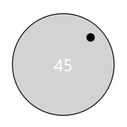
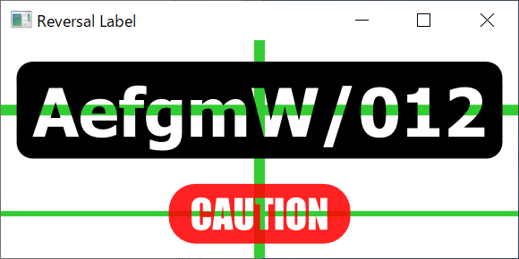
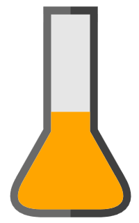
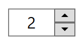
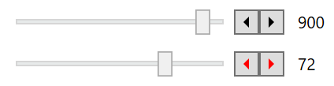

# WPF Control Collection

A collection of WPF controls such as ProgressBar.

## Dial

## Label

### Reversal Label

## TabControl

### Double Curved Tab

## ProgressBar

### Striped ProgressBar

https://user-images.githubusercontent.com/7205690/147396229-565413fc-8200-4783-9fed-1ce435662e0c.mp4

### Flask ProgressBar

## Slider

### NumericUpDown

This is WinForms-like plain old NumericUpDown.

### Slider Plus

## TextBox

### Custom Caret

This is inspired by [Customizing the Caret of a WPF TextBox](https://www.codeproject.com/Articles/633935/Customizing-the-Caret-of-a-WPF-TextBox) but when FlowDirection is `RightToLeft`, the movement of caret is incomplete (and unlikely to be be completed).

### End TextBox

## ListView

### Insertable List

### Switchable ComboBox

## Button

### Clip Shape Button

### Staged Button

## License

 - MIT License
